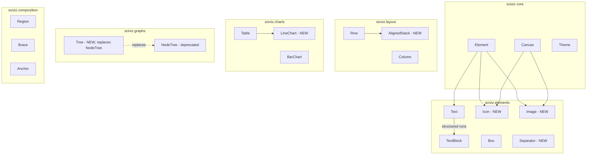

# Ten of Ten

Promote sciviz from a competent diagramming library to one where a single
authoring document is sufficient to produce any scientific figure in its
vocabulary. The forcing function is to reproduce all 10 user-supplied
reference figures as new galleries under the constraint that each is
significantly shorter than its hand-rolled equivalent would be.

## Design bets (locked in from Q&A)

- **Balanced surface.** Add specialized primitives only where figure
  vocabulary is genuinely distinct (`Icon`, `Image`, `LineChart`, `Tree`,
  `Separator`). Reject one-off primitives (no `BarComparison`,
  `MemoryStrip`, `TokenGrid`, `HeaderCard`, `Fraction`, `YesNo`). One-off
  looks are compositions, not APIs.
- **Icons.** Bundle a Lucide subset (~50 icons) as static SVG path data
  under `sciviz._assets`, exposed as `Icon("camera")`. One canonical
  source, tight aesthetic, zero runtime deps.
- **Cross-parent column alignment.** Structural, via `AlignedStack(a, b,
  ...)`. No named-group globals, no threaded layout objects. Siblings
  inside an `AlignedStack` see each other's column widths through a
  two-pass measure.
- **Rich text.** Structured runs. `Text` gains an alternate constructor
  accepting `[(str, style_dict), ...]`. No markdown parser. `TextBlock`
  composes runs per line. Additive; no new `Markup` class.
- **Rollout.** Single plan, executed back-to-back. All 10 reference
  figures become new galleries.

## Reference images (ground truth)

Store the 10 user-provided images at `gallery/reference/fig01.png` ...
`gallery/reference/fig10.png`, with a `gallery/reference/README.md`
mapping each to its target gallery file. These are the pixel-level
acceptance targets during Wave 7.

## Architecture diagram



## Wave 0: infrastructure

- Add `gallery/reference/` containing the 10 source PNGs plus a README
  mapping each to its target gallery file (Wave 7).
- Add `sciviz/_assets/__init__.py` shipping Lucide SVG path data as a
  dict `{name: "M ..."}`. ~50 icons curated from
  [lucide.dev](https://lucide.dev) (MIT-licensed). Path data extracted
  at contribution time, not runtime. Included in `pyproject.toml`
  `[tool.setuptools.package-data]`.
- Add `pyproject.toml` optional extra `image = ["Pillow>=10"]` for
  raster embedding. SVG `<image>` with base64 data URI does not need
  Pillow at render time, but bbox inference for JPEG may. PNG header
  sniffing is hand-rolled and needs nothing.

## Wave 1: canvas primitive support

Extend [`sciviz/core/_canvas.py`](sciviz/core/_canvas.py) with two new
methods used by `Icon` and `Image`:

- `canvas.svg_path(x, y, w, h, path_data, fill, stroke, stroke_width)` --
  renders an SVG `<path>` sized into a bbox via `viewBox` + nested
  `<svg>`. Used by `Icon` to place any Lucide path at any size.
- `canvas.image(x, y, w, h, data_uri)` -- renders
  `<image href=... x=... y=... width=... height=... preserveAspectRatio=.../>`.
  Used by `Image`. PNG/JPEG/SVG all work since the href is a data URI.

Both are thin wrappers around existing SVG emission. `resvg-py` already
handles `<image>` and nested `<svg>`, so PNG export continues to work
unchanged.

## Wave 2: Icon + Image + Separator

New files:

- [`sciviz/elements/_icon.py`](sciviz/elements/_icon.py):
  `Icon(name, *, size=16, color="dark", stroke_width=1.5)`. Looks up
  `name` in `sciviz._assets`. `measure` returns `BBox(size, size)`.
  `render` calls `canvas.svg_path(...)`. Unknown-name error lists
  available icons.
- [`sciviz/elements/_image.py`](sciviz/elements/_image.py):
  `Image(path_or_bytes, *, width=None, height=None, fit="contain")`.
  Reads file at construction (base64 encodes), infers intrinsic size
  from PNG/JPEG header (hand-rolled ~20 LOC, no Pillow needed for PNG)
  or from SVG `viewBox`. `width`/`height` override; `fit` controls
  aspect when only one is given.
- [`sciviz/elements/_separator.py`](sciviz/elements/_separator.py):
  `Separator(length=None, *, orientation="horizontal", style="solid",
  color="muted")`. `length=None` stretches to fill via
  `MatchSize`-style protocol (needs small plumbing in `Row`/`Column`).

Wire all three into
[`sciviz/elements/__init__.py`](sciviz/elements/__init__.py) and
[`sciviz/__init__.py`](sciviz/__init__.py) `__all__`.

Tests: `tests/test_icon.py`, `tests/test_image.py`,
`tests/test_separator.py`. Cover: unknown-icon error, known-icon render
output contains path data, Image PNG intrinsic size read, Image with
only `width=` preserves aspect, Separator horizontal/vertical, Separator
`style="dashed"` emits `stroke-dasharray`.

## Wave 3: structured text runs

Extend [`sciviz/elements/_text.py`](sciviz/elements/_text.py)
`Text.__init__` to accept either:

- Existing: `Text("...", size=..., color=..., weight=..., italic=...)`
  -- unchanged.
- New: `Text([(str, dict), ...])` where each dict overrides `color`,
  `weight`, `italic`, `size`. Measure sums run widths; render emits
  `<tspan>` per run. Align/rotate semantics unchanged.

Extend `TextBlock` similarly: each line can be a plain str OR a run
list.

Add a convenience helper `Span(text, **style)` that returns
`(text, style)` so authors write:

```python
Text([
    Span("Principle 1:", weight="700"),
    " instruction adherence ",
    Span("(weight 4)", color="negative"),
])
```

Tests (`tests/test_text_runs.py`): width is sum of run widths; mixed
runs render `<tspan>` with correct attrs; `TextBlock` mixes plain-string
and run-list lines; existing `Text("...")` output unchanged
(pixel-parity on touched golden file).

## Wave 4: AlignedStack

New file
[`sciviz/layout/_aligned_stack.py`](sciviz/layout/_aligned_stack.py):

- `AlignedStack(*children, axis="vertical", gap="m", column_widths="shared", row_heights="shared")`.
- Two-pass measure: first pass, each direct child whose own root is a
  `Table`/`Row`/`Grid` reports its per-column widths; second pass,
  `AlignedStack` broadcasts the max-per-column back into each child via
  a new `Element._apply_shared_columns(widths)` optional hook. Children
  that don't implement the hook render as-is.
- Plumbing: add the optional `_apply_shared_columns` hook to
  [`sciviz/charts/__init__.py`](sciviz/charts/__init__.py) `Table`,
  [`sciviz/layout/_row_column.py`](sciviz/layout/_row_column.py) `Row`
  (column = per-child intrinsic width at equal gap), and `Grid` in
  [`sciviz/layout/_grid.py`](sciviz/layout/_grid.py).

Tests (`tests/test_aligned_stack.py`): two `Table`s with differing
intrinsic column widths under `AlignedStack` render with identical
column x-positions; a `Row` of `Box`es and a `Table` align column
boundaries when marked as same-structure; `AlignedStack` with
`column_widths="independent"` degrades to plain `Column`.

## Wave 5: LineChart + Tree (replaces NodeTree)

### LineChart

New file [`sciviz/charts/_line_chart.py`](sciviz/charts/_line_chart.py):

- `LineChart(series, *, x_range, y_range, x_ticks=None, y_ticks=None, width=160, height=100, x_label=None, y_label=None, legend="inside", annotations=None)`.
- `series`: list of `Line(name, points, color=..., style="solid"|"dashed"|"dotted", width=None)`.
- `annotations`: list of
  `Annotate(at=(x, y), text=..., offset=..., arrow=True)` for the inline
  call-outs in Figure 6.
- Reuses existing axis/tick code from `BarChart` where possible; pull
  the shared bits into `sciviz/charts/_axis.py`.

Tests (`tests/test_line_chart.py`): two-series chart measures to
requested `(width, height)` plus axis padding, tick labels appear at
correct positions, annotations render with arrow pointing at data
coordinate.

### Tree -- replaces NodeTree in public API

New file [`sciviz/graphs/_tree.py`](sciviz/graphs/_tree.py):

- `Tree(root, *, node_style=None, edge_style=None, layout="topdown")`.
- `root`: `TreeNode(content, children=[...], edge_to_parent=EdgeStyle(color=..., label=..., style=...))`.
- `content` is any `Element` (not just strings -- a node can be a `Row`,
  `Box`, anything).
- Per-edge colour, dash, and label supported out of the box.
- Keep [`sciviz/graphs/__init__.py`](sciviz/graphs/__init__.py)
  `NodeTree` as a deprecated alias that constructs a `Tree` under the
  hood. Gallery `crossbar_pruning.py` and `bplus_tree.py` migrate to
  `Tree` in Wave 7.

Tests (`tests/test_tree.py`): node content is arbitrary `Element`,
per-edge colour emits correct `stroke=`, edge label positions midway,
`Tree` with children that are themselves `Row`s measures correctly.

## Wave 6: upgrades to existing primitives

Each is a small targeted extension; none break existing API.

- [`sciviz/composition/_brace.py`](sciviz/composition/_brace.py) -- add
  `Brace.spanning(element, label=..., direction=...)` classmethod that
  defers `span` computation until parent measures. Used by all the
  "brace over row" patterns in Figures 2/3/7/8/9. Avoids authors
  hand-computing pixel widths.
- [`sciviz/composition/_region.py`](sciviz/composition/_region.py) --
  add `label_position="top"|"left"|"right"|"bottom"` (default `"top"`
  preserves today's behaviour) and `annotations=[(side, text), ...]`
  for Figure 3's "Stage 1: Cross-modality" side labels.
- [`sciviz/composition/_region.py`](sciviz/composition/_region.py) --
  add `corner_badge=Element` (typically a `Box` with a circled digit)
  for Figure 5's numbered method labels.
- [`sciviz/elements/_text.py`](sciviz/elements/_text.py) -- already
  handled in Wave 3.
- [`sciviz/core/_theme.py`](sciviz/core/_theme.py) -- add three new
  semantic colour roles (`"positive"`, `"negative"`, `"warning"`) so
  text runs can say `color="negative"` rather than a hex. Extend
  `theme.preset_slides()` side-by-side.

Tests extend existing `test_brace.py`, `test_region.py`,
`test_theme.py` with new behaviours.

## Wave 7: reproduce all 10 reference figures

Each figure becomes a gallery file under `gallery/`. Each gallery:

1. Uses only public `sciviz` API.
2. Is shorter than the current longest gallery (target: median ~80 LOC,
   ceiling 150 LOC).
3. Side-by-side visual compare with its PNG in `gallery/reference/`.

Proposed mapping (names are provisional; finalized in the wave once the
paper-figure correspondence is nailed down):

| Gallery               | Feature used                                                             |
| --------------------- | ------------------------------------------------------------------------ |
| `gallery/fig01.py`    | Wave 2 `Image`, Wave 6 `Brace.spanning`.                                 |
| `gallery/fig02.py`    | Existing primitives + Wave 3 runs for coloured emphasis.                 |
| `gallery/fig03.py`    | Wave 6 `Region` `label_position` + `annotations`.                        |
| `gallery/fig04.py`    | Wave 4 `AlignedStack`.                                                   |
| `gallery/fig05.py`    | Wave 6 `Region` `corner_badge`, Wave 3 runs.                             |
| `gallery/fig06.py`    | Wave 5 `LineChart` with annotations.                                     |
| `gallery/fig07.py`    | Wave 5 `Tree` with per-edge colour.                                      |
| `gallery/fig08.py`    | Wave 2 `Icon` + Wave 6 `Brace.spanning`.                                 |
| `gallery/fig09.py`    | Wave 2 `Icon`.                                                           |
| `gallery/fig10.py`    | Wave 2 `Separator`, Wave 4 `AlignedStack`.                               |

Add to `tests/test_gallery_smoke.py` and
`tests/test_gallery_pixel_parity.py`. Bake 10 new hashes into
`tests/fixtures/gallery_hashes.json`.

## Wave 8: single authoring doc

Rewrite [`docs/AUTHORING.md`](docs/AUTHORING.md) so reading it is
genuinely sufficient to author any of the 10 figures:

- Start with a table: "I want to draw X → use primitive Y".
- Worked examples drawn from the 10 figures, minimum viable snippet
  each.
- Explicitly close with "if you reach for something not in this doc,
  file an issue; the library is intentionally small."

Extend `tests/test_authoring_examples.py` to execute every `python`
block in the doc (it already does this; just needs the new snippets).

Update [`sciviz/__init__.py`](sciviz/__init__.py) `__all__` and module
docstring; update [`README.md`](README.md) quick-start to feature `Icon`
+ `Image` + `AlignedStack` + text runs.

## Wave 9: verification

- Full `pytest` -- target >180 tests (current 151 + ~30 new).
- Pixel parity on all 22 galleries (12 existing + 10 new).
- Import direction test extended for new modules (`sciviz.layout` can
  import `sciviz.core` but not `sciviz.charts`, etc.).
- `sciviz-debug` smoke run on 3 of the new figures to confirm the
  router and label-placer cope with the new primitives.
- Public surface golden file updated.
- `scripts/gen_readme_surface.py` re-run.
- Manual side-by-side review: each gallery output vs.
  `gallery/reference/figNN.png`.

## Deliberately excluded (and why)

- `BarComparison`, `MemoryStrip`, `TokenGrid`, `HeaderCard`, `Fraction`,
  `YesNo` -- per "balanced surface" choice, these compose from existing
  primitives.
- New `Markup` class -- per "text runs" choice, `Text`/`TextBlock`
  absorb this.
- Named-group column alignment -- per "structural share" choice,
  `AlignedStack` is the only mechanism.
- Math backend upgrade -- out of scope; existing matplotlib path
  handles all math in the 10 figures.
- Interactive widgets, multi-panel figure class, performance work --
  deferred; not needed for the 10-figure target.

## Honest pre-mortem

- **AlignedStack two-pass measure** is the most architecturally
  invasive change. Risk: existing `Element.measure` contract is
  single-pass; `_apply_shared_columns` is a new hook. Mitigation: hook
  is optional, defaults to no-op, only consulted when inside an
  `AlignedStack`. Fall back to `Column` if any child doesn't implement
  it.
- **Image in SVG → PNG via resvg-py**: nested `<image>` with data URI
  is standard; confirmed supported. If `cairosvg` (PDF path) chokes on
  base64 PNG, document and fix with a one-liner.
- **Lucide subset**: 50 icons is a judgment call. If authoring the 10
  galleries reveals we need more, add them in Wave 7 as they come up
  rather than preemptively.
- **Tree replacing NodeTree**: we keep `NodeTree` as a deprecated
  alias; a grep over `gallery/` will catch existing call sites to
  migrate in Wave 7.
- **Figures might not all be 1:1 reproducible**: some have hand-drawn
  artistic touches (anime silhouettes, photograph crops) that are
  legitimately raster-only. Those galleries use `Image` to embed the
  raster and compose `sciviz` primitives around it. That is the
  correct answer, not a workaround.

## Todo list

- **wave0_reference** -- Wave 0: copy 10 reference PNGs to
  `gallery/reference/` with README mapping; add `sciviz/_assets/`
  package stub; register `package_data` in `pyproject.toml`.
- **wave1_canvas** -- Wave 1: extend `Canvas` with `svg_path()` and
  `image()` methods; tests for both.
- **wave2_icon_image_separator** -- Wave 2: implement `Icon` (Lucide
  bundle ~50 icons), `Image` (PNG/JPEG/SVG with intrinsic-size
  sniffing), `Separator`; wire into public API; add tests.
- **wave3_text_runs** -- Wave 3: extend `Text`/`TextBlock` to accept
  structured runs `[(str, style_dict), ...]`; add `Span` helper; tests
  including parity for existing plain-string API.
- **wave4_aligned_stack** -- Wave 4: implement `AlignedStack` with
  two-pass measure; add `_apply_shared_columns` hook to
  `Table`/`Row`/`Grid`; tests for cross-parent column alignment.
- **wave5_line_chart_tree** -- Wave 5: implement `LineChart` (with
  `Annotate`), `Tree` (arbitrary `Element` nodes + per-edge
  colour/label/style); keep `NodeTree` as deprecated alias; tests.
- **wave6_upgrades** -- Wave 6: add `Brace.spanning()`, `Region`
  `label_position` + `annotations` + `corner_badge`, semantic
  positive/negative/warning colour roles; extend existing tests.
- **wave7_galleries** -- Wave 7: reproduce all 10 reference figures as
  `gallery/fig01.py`...`fig10.py`; bake new pixel-parity hashes;
  migrate existing `NodeTree` users to `Tree`.
- **wave8_authoring_doc** -- Wave 8: rewrite `docs/AUTHORING.md` as the
  single-doc reference; update `__init__.py` docstring and `README.md`
  quick-start; confirm `test_authoring_examples` still passes.
- **wave9_verify** -- Wave 9: full pytest, pixel parity on 22
  galleries, import-direction test, public-surface golden,
  `sciviz-debug` smoke on 3 new figures, manual side-by-side review
  against `gallery/reference/`.
